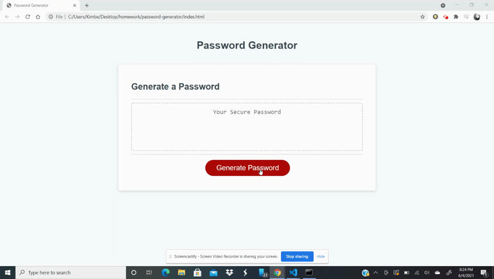

# password-generator

## Description

This application generations a random password based on user input to help increase password security for user data. It focuses on a JavaScript logic and uses prompts/confirms.

## Installation

Follow provided link to application and to begin prompts for user input click the "Generate Password" button to begin answering prompt. Please keep number between 8-128 and you must enter a number  and at least 1 criteria variable to continue.

## Usage
Use this application to create random passwords that fit needed criteria. Increase you security on personal data but updated passwords often and with this randomized logic. 

## Credits

Using information from an array of learning platforms and provided starter code I was able to build this application.
